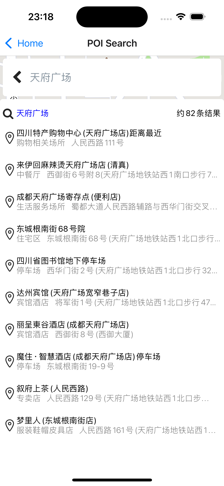
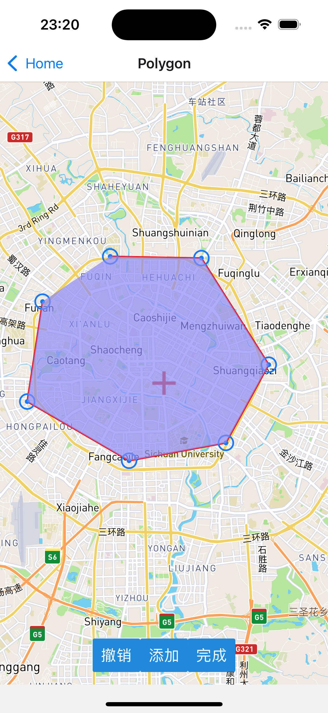

# React Native Map SDK for iOS and Android

react-native-mapa是一款开源的React Native地图组件，支持iOS和Android。

## 成为react-native-mapa的核心开发者
react-native-mapa面相开源，我们欢迎任何感兴趣的开发者加入社区, 进入[留言区](http://xxxx)。

---

<table>
<tr>
    <td colspan="2">
        
    </td>
    <td colspan="2">
        
    </td>
    <td colspan="2">
        
    </td>
</tr>
<tr>
</tr>

<tr>
    <td colspan="2">
        
    </td>
    <td colspan="2">
        
    </td>
    <td colspan="2">
        
    </td>
</tr>
<tr>
</tr>


</table>

---

## Prerequisite
react-native-mapa底层依赖mapbox，因此需要提供`Mapbox Access Token`。

## Dependencies

- [node](https://nodejs.org)
- [npm](https://www.npmjs.com/)
- [React Native](https://facebook.github.io/react-native/) (0.70+)

## Installation

查看安装文档[Installation](INSTALL.md)

## Run Project

#### IOS
```
# YARN
yarn run ios

# NPM
npm run ios
```
#### Android
```
# YARN
yarn run android

# NPM
npm run android

```
## Example
```
import Mapa from 'react-native-mapa';
import {SafeAreaView, StyleSheet} from 'react-native';
import React from 'react';

function Mapview({}: any): React.JSX.Element {
    const projection = 'mercator';
    const styleID = 'MapboxVector';

    return (
        <SafeAreaView style={styles.container}>
            <Mapa.MapView projection={projection} style={styleID}>
                <Mapa.Camera />
                <Mapa.Compass />
            </Mapa.MapView>
        </SafeAreaView>
    );
}

export default Mapview;

const styles = StyleSheet.create({
    container: {
        height: '100%',
    },
});
```

## DOCUMENTTATION
#### Components
- [Mapview](./docs//MapView.md)
- [Camera](./docs//Camera.md)
- [Background](./docs/Background.md)?
- [Location](./docs//LineLayer.md)
- [ZoomInOut](./docs/ZoomInOut.md)
- [Compass](./docs/Compass.md)？
- [Scalebar](./docs/Scalebar.md)？
- [POIFinder](./docs/POIFinder.md)
- [Weather](./docs//Weather.md)
- [Images](./docs/image/Images.md)
- [Image](./docs/image/Image.md)
- [Marker](./docs/Marker.md)

#### Sources
- [VectorSource](./docs/VectorSource.md)
- [RasterSource](./docs/RasterSource.md)
- [GeoJSONSource](./docs/GeoJSONSource.md)
- [ImageSource](./docs/image/ImageSource.md)

#### Layers
- [LineLayer](./docs/LineLayer.md)
- [FillLayer](./docs/FillLayer.md)
- [SymbolLayer](./docs/SymbolLayer.md)
- [RasterLayer](./docs/RasterLayer.md)
- [CircleLayer](./docs/CircleLayer.md)
- [FillExtrusionLayer](./docs/FillExtrusionLayer.md)
- [ModelLayer](./docs/ModelLayer.md)

#### Draw
- [PolylinePainter](./docs/painter/PolylinePainter.md)
- [PolygonPainter](./docs/painter/PolygonPainter.md)
- [CirclePainter](./docs/painter/CirclePainter.md)
- [RectanglePainter](./docs/painter/RectanglePainter.md)